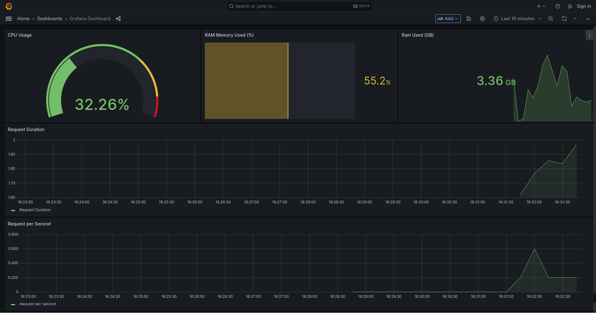

# api-monitoring

API Monitoring with Prometheus, Grafana, Sanic API

### Prerequisites

- Docker compose with Grafana, Prometheus
- Python

### Run the Sanic API

Run command below to start the API, make sure you install the dependencies in `requirements.txt`

```bash
$ python api/server.py
```

You can access to http://localhost:8000 to check if the API is available or not

### Run Prometheus, Grafana with Docker

Firstly, you need to check your Docker IP and replace it to

`grafana/datasources/datasources.yml`:

```yml
apiVersion: 1

datasources:
  - name: prometheus
    type: prometheus
    access: proxy
    url: http://172.17.0.1:9090 # Internal Docker IP
```

`prometheus/prometheus.yaml`:

```yml
global:
  scrape_interval: 5s
  evaluation_interval: 30s
scrape_configs:
  - job_name: api-tracking
    honor_labels: true
    static_configs:
      - targets: ["172.17.0.1:8000"] # Internal Docker IP
```

Then run the Docker compose:

```bash
$ docker compose up -d
```

Go to http://localhost:3003 in your browser, select "Home" > "Dashboard" > "Grafana Dashboard"

Now you need to request **continuously** to http://localhost:8000 or http://localhost:8000/users for Prometheus can collect the metrics and render the statistic to Grafana dashboard

The statistic in dashboard includes:

- CPU Usage
- RAM Memory Used (%)
- RAM Used
- API Request Duration
- API Request per Second

Final results:


